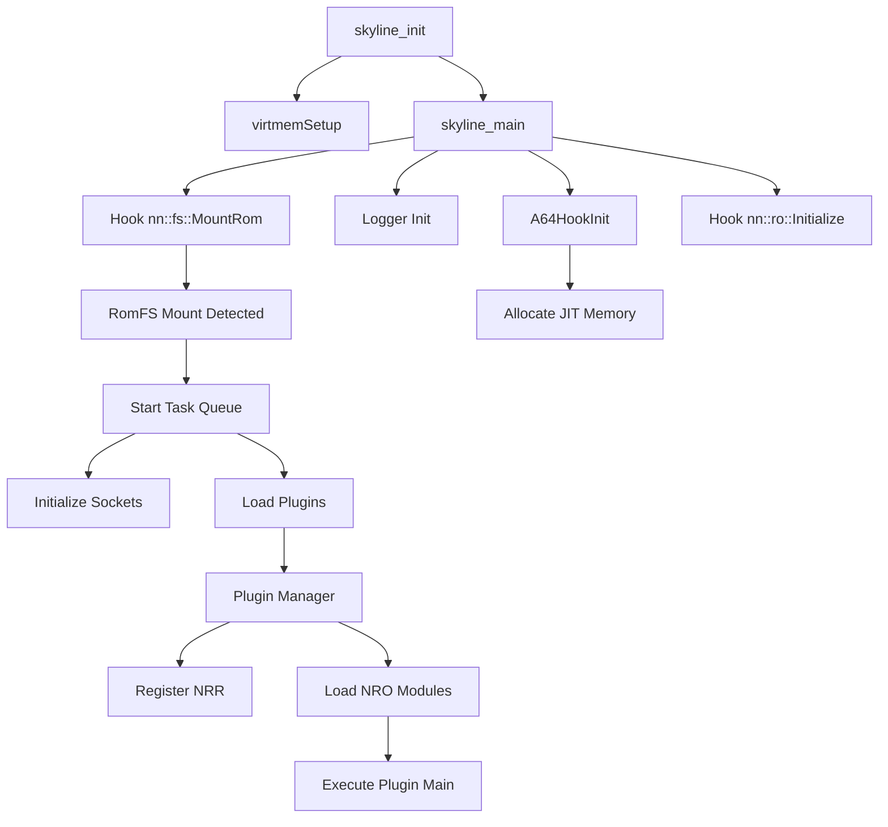

Skyline is a runtime hooking and code patching framework that runs as a plugin for Nintendo Switch games. It provides a comprehensive system for intercepting function calls, loading dynamic modules, and modifying game behavior at runtime.

## Core Components

The framework consists of several key subsystems that work together:

<CardGroup cols={2}>
  <Card title="Hooking System" icon="link" href="/core/hooking-system">
    A64InlineHook provides ARM64 instruction-level hooking capabilities
  </Card>
  <Card title="Plugin System" icon="puzzle-piece" href="/core/plugin-system">
    Dynamic loading and management of NRO plugin modules
  </Card>
  <Card title="Memory Management" icon="memory" href="/core/memory-management">
    Virtual memory setup and JIT compilation support
  </Card>
  <Card title="Logger System" icon="terminal">
    TCP and SD card logging for debugging and diagnostics
  </Card>
</CardGroup>

## Initialization Flow

The initialization sequence is critical to understanding how Skyline integrates into a game process. Here's the complete flow from `source/main.cpp`:

<Steps>
  <Step title="Entry Point - skyline_init()">
    Called when Skyline is first loaded into the game process.
    
    ```cpp source/main.cpp:142-147
    extern "C" void skyline_init() {
        skyline::utils::init();
        virtmemSetup();  // needed for libnx JIT
        
        skyline_main();
    }
    ```
    
    This function performs two critical setup operations:
    - Initializes utility subsystems and discovers memory regions
    - Sets up virtual memory for JIT compilation support
  </Step>
  
  <Step title="Main Initialization - skyline_main()">
    Initializes core systems and sets up critical hooks.
    
    ```cpp source/main.cpp:101-140
    void skyline_main() {
        // populate our own process handle
        envSetOwnProcessHandle(skyline::proc_handle::Get());
        
        // init hooking setup
        A64HookInit();
        
        skyline::logger::setup_socket_hooks();
        
        // initialize logger
        nn::fs::MountSdCardForDebug("sd");
        skyline::logger::s_Instance = new skyline::logger::TcpLogger();
        skyline::logger::s_Instance->Log("[skyline_main] Beginning initialization.\\n");
        
        // override exception handler to dump info
        nn::os::SetUserExceptionHandler(exception_handler, exception_handler_stack, 
                                        sizeof(exception_handler_stack), &exception_info);
        
        // hook to prevent the game from double mounting romfs
        A64HookFunction(reinterpret_cast<void*>(nn::fs::MountRom), 
                       reinterpret_cast<void*>(handleNnFsMountRom),
                       (void**)&nnFsMountRomImpl);
        
        A64HookFunction(reinterpret_cast<void*>(nn::ro::Initialize), 
                       reinterpret_cast<void*>(nn_ro_init), 
                       (void**)&nnRoInitializeImpl);
    }
    ```
  </Step>
  
  <Step title="Hook System Initialization">
    `A64HookInit()` allocates JIT memory regions for storing trampolines and inline hook handlers.
    
    Two separate JIT regions are created:
    - **Normal Hook JIT**: Stores trampolines for `A64HookFunction` calls
    - **Inline Hook JIT**: Located near the main text region for `A64InlineHook` calls
    
    See [Hooking System](/core/hooking-system) for details.
  </Step>
  
  <Step title="RomFS Mount Hook">
    The framework hooks `nn::fs::MountRom` to detect when the game mounts its RomFS.
    
    ```cpp source/main.cpp:48-64
    Result handleNnFsMountRom(char const* path, void* buffer, unsigned long size) {
        Result rc = 0;
        rc = nnFsMountRomImpl(path, buffer, size);
        
        skyline::utils::g_RomMountStr = std::string(path) + ":/";
        
        // Some games call this method multiple times, ensure we only initialize once
        g_MountRomInit.call_once([]() {
            // start task queue
            skyline::utils::SafeTaskQueue* taskQueue = 
                new skyline::utils::SafeTaskQueue(100);
            taskQueue->startThread(20, 3, 0x10000);
            taskQueue->push(new std::unique_ptr<skyline::utils::Task>(after_romfs_task));
            nn::os::WaitEvent(&after_romfs_task->completionEvent);
        });
        
        return rc;
    }
    ```
    
    This ensures plugins are loaded only after the game's RomFS is available.
  </Step>
  
  <Step title="Plugin Loading">
    Once RomFS is mounted, the `after_romfs_task` executes:
    
    ```cpp source/main.cpp:26-41
    static skyline::utils::Task* after_romfs_task = new skyline::utils::Task{[]() {
        const size_t poolSize = 0x600000;
        void* socketPool = memalign(0x4000, poolSize);
        nn::socket::Initialize(socketPool, poolSize, 0x20000, 14);
        
        skyline::logger::s_Instance->StartThread();
        
        // load plugins
        auto manager = new skyline::plugin::Manager();
        manager->LoadPluginsImpl();
    }};
    ```
    
    This initializes networking (for TCP logger) and loads all plugins from `romfs:/skyline/plugins`.
  </Step>
</Steps>

## Memory Layout

Skyline discovers and tracks several key memory regions during initialization:

| Region | Purpose | Address Variable |
|--------|---------|------------------|
| `.text` | Game's executable code | `g_MainTextAddr` |
| `.rodata` | Read-only data segment | `g_MainRodataAddr` |
| `.data` | Initialized data segment | `g_MainDataAddr` |
| `.bss` | Uninitialized data segment | `g_MainBssAddr` |
| `heap` | Dynamic memory allocation | `g_MainHeapAddr` |

<Info>
These addresses are logged during initialization and are accessible via the `skyline::utils` namespace throughout the framework.
</Info>

## Process Handle Management

Skyline maintains its own process handle for memory operations:

```cpp
envSetOwnProcessHandle(skyline::proc_handle::Get());
```

This handle is used throughout the framework for:
- Memory mapping operations in the hooking system
- Virtual memory allocation
- Process memory queries

## Exception Handling

Skyline installs a custom exception handler to provide detailed crash reports:

```cpp source/main.cpp:14-24
void exception_handler(nn::os::UserExceptionInfo* info) {
    skyline::logger::s_Instance->LogFormat("Exception occurred!\\n");
    
    skyline::logger::s_Instance->LogFormat("Error description: %x\\n", info->ErrorDescription);
    for (int i = 0; i < 29; i++)
        skyline::logger::s_Instance->LogFormat("X[%02i]: %" PRIx64 "\\n", i, info->CpuRegisters[i].x);
    skyline::logger::s_Instance->LogFormat("FP: %" PRIx64 "\\n", info->FP.x);
    skyline::logger::s_Instance->LogFormat("LR: %" PRIx64 "\\n", info->LR.x);
    skyline::logger::s_Instance->LogFormat("SP: %" PRIx64 "\\n", info->SP.x);
    skyline::logger::s_Instance->LogFormat("PC: %" PRIx64 "\\n", info->PC.x);
}
```

This handler logs all CPU registers and exception information before the game crashes, making debugging significantly easier.

## Thread Safety

The hooking system uses a mutex to ensure thread-safe hook installation:

```cpp source/skyline/inlinehook/And64InlineHook.cpp:522
static nn::os::MutexType hookMutex;
```

<Warning>
Always ensure hooks are installed during initialization or on a single thread. Concurrent hook installation, while protected by a mutex, can still lead to race conditions in the hooked code.
</Warning>

## Component Relationships



This architecture ensures that:
1. Core systems are initialized before any hooks are installed
2. Plugins are loaded only after the game's file system is ready
3. All memory regions are properly set up before dynamic code generation
4. Exception handling is in place before any potentially unsafe operations

## Next Steps

<CardGroup cols={2}>
  <Card title="Hooking System" icon="link" href="/core/hooking-system">
    Learn how to intercept and modify function calls
  </Card>
  <Card title="Plugin Development" icon="code" href="/core/plugin-system">
    Create your own Skyline plugins
  </Card>
</CardGroup>