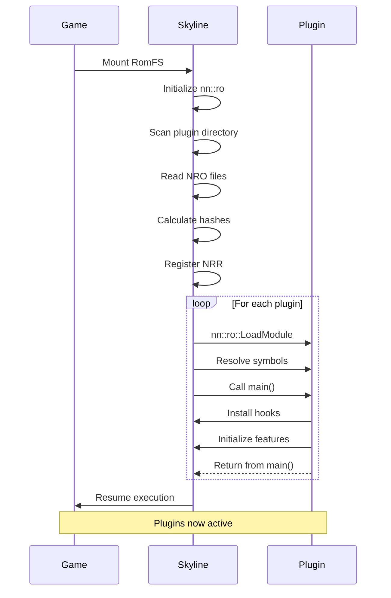

Skyline's plugin system allows you to extend game functionality by loading custom NRO (Nintendo Relocatable Object) modules at runtime. Plugins are dynamically loaded from the game's RomFS and can use the full Skyline API, including hooks, logging, and memory utilities.

## Overview

The plugin system is managed by the `PluginManager` class, which handles:
- Discovery of plugin files in RomFS
- NRR (Nintendo Relocatable Range) registration for security
- Loading NRO modules with proper memory setup
- Symbol resolution and linking
- Plugin entrypoint execution

## Plugin Location

```cpp include/skyline/plugin/PluginManager.hpp:13
static constexpr auto PLUGIN_PATH = "skyline/plugins";
```

Plugins must be placed in the game's RomFS at:
```
romfs:/skyline/plugins/
```

For example, if your game mounts RomFS as `rom:/`, plugins should be at:
```
rom:/skyline/plugins/my_plugin.nro
```

<Info>
The plugin directory is scanned recursively, so you can organize plugins in subdirectories:
```
rom:/skyline/plugins/combat/damage_modifier.nro
rom:/skyline/plugins/graphics/fps_unlocker.nro
```
</Info>

## Plugin Structure

Each plugin is tracked with the following information:

```cpp include/skyline/plugin/PluginManager.hpp:15-23
struct PluginInfo {
    std::string Path;
    std::unique_ptr<u8> Data;
    size_t Size;
    utils::Sha256Hash Hash;
    nn::ro::Module Module;
    std::unique_ptr<u8> BssData;
    size_t BssSize;
};
```

- **Path**: Full path to the plugin file in RomFS
- **Data**: Plugin file contents (NRO executable)
- **Size**: Size of the NRO file
- **Hash**: SHA256 hash for NRR registration
- **Module**: `nn::ro` module handle after loading
- **BssData**: Allocated memory for uninitialized data (.bss section)
- **BssSize**: Size of .bss section

## Loading Process

The plugin loading process happens in several stages after RomFS is mounted:

<Steps>
  <Step title="Initialize nn::ro">
    The dynamic module loader must be initialized first.
    
    ```cpp source/skyline/plugin/PluginManager.cpp:18
    nn::ro::Initialize();
    ```
    
    This prepares the Nintendo SDK's runtime loader for loading NRO files.
  </Step>
  
  <Step title="Discover Plugins">
    Recursively walk the plugin directory to find all NRO files.
    
    ```cpp source/skyline/plugin/PluginManager.cpp:21-25
    skyline::utils::walkDirectory(
        utils::g_RomMountStr + PLUGIN_PATH,
        [this](nn::fs::DirectoryEntry const& entry, std::shared_ptr<std::string> path) {
            if (entry.type == nn::fs::DirectoryEntryType_File)
                m_pluginInfos.push_back(PluginInfo{.Path = *path});
        }
    );
    ```
    
    Each file found is added to the plugin list for processing.
  </Step>
  
  <Step title="Read and Validate Plugins">
    Each plugin file is read and validated as a proper NRO.
    
    ```cpp source/skyline/plugin/PluginManager.cpp:42-93
    // Open file
    nn::fs::FileHandle handle;
    rc = nn::fs::OpenFile(&handle, plugin.Path.c_str(), nn::fs::OpenMode_Read);
    
    // Get size
    s64 fileSize;
    rc = nn::fs::GetFileSize(&fileSize, handle);
    nn::fs::CloseFile(handle);
    
    // Allocate and read
    plugin.Size = fileSize;
    plugin.Data = std::unique_ptr<u8>((u8*)memalign(0x1000, plugin.Size));
    rc = skyline::utils::readFile(plugin.Path, 0, plugin.Data.get(), plugin.Size);
    
    // Get BSS size requirement
    rc = nn::ro::GetBufferSize(&plugin.BssSize, plugin.Data.get());
    ```
    
    Invalid files are removed from the plugin list.
  </Step>
  
  <Step title="Calculate Hashes">
    SHA256 hashes are computed for NRR registration.
    
    ```cpp source/skyline/plugin/PluginManager.cpp:96-107
    nn::ro::NroHeader* nroHeader = (nn::ro::NroHeader*)plugin.Data.get();
    nn::crypto::GenerateSha256Hash(
        &plugin.Hash, 
        sizeof(utils::Sha256Hash), 
        nroHeader, 
        nroHeader->size
    );
    
    // Check for duplicates
    if (sortedHashes.find(plugin.Hash) != sortedHashes.end()) {
        // Skip duplicate
    }
    sortedHashes.insert(plugin.Hash);
    ```
    
    Duplicate plugins (same hash) are automatically skipped.
  </Step>
  
  <Step title="Build and Register NRR">
    Create an NRR (Nintendo Relocatable Range) buffer to register all plugin hashes.
    
    ```cpp source/skyline/plugin/PluginManager.cpp:115-154
    // Allocate NRR buffer
    m_nrrSize = ALIGN_UP(
        sizeof(nn::ro::NrrHeader) + (m_pluginInfos.size() * sizeof(utils::Sha256Hash)), 
        0x1000
    );
    m_nrrBuffer = std::unique_ptr<u8>((u8*)memalign(0x1000, m_nrrSize));
    
    // Get program ID
    u64 program_id = get_program_id();
    
    // Initialize NRR header
    auto nrrHeader = reinterpret_cast<nn::ro::NrrHeader*>(m_nrrBuffer.get());
    *nrrHeader = nn::ro::NrrHeader{
        .magic = 0x3052524E,  // "NRR0"
        .program_id = {program_id},
        .size = (u32)m_nrrSize,
        .type = 0,  // ForSelf
        .hashes_offset = sizeof(nn::ro::NrrHeader),
        .num_hashes = (u32)m_pluginInfos.size(),
    };
    
    // Copy hashes into NRR (must be sorted)
    utils::Sha256Hash* hashes = 
        reinterpret_cast<utils::Sha256Hash*>((size_t)m_nrrBuffer.get() + nrrHeader->hashes_offset);
    auto curHashIdx = 0;
    for (auto hash : sortedHashes) {
        hashes[curHashIdx++] = hash;
    }
    
    // Register with nn::ro
    rc = nn::ro::RegisterModuleInfo(&m_registrationInfo, m_nrrBuffer.get());
    ```
    
    <Info>
    The NRR system is a security feature that requires all dynamically loaded modules to be pre-registered with their hashes. Hashes must be sorted for registration to succeed.
    </Info>
  </Step>
  
  <Step title="Load NRO Modules">
    With the NRR registered, load each plugin module.
    
    ```cpp source/skyline/plugin/PluginManager.cpp:163-181
    // Allocate BSS memory
    plugin.BssData = std::unique_ptr<u8>((u8*)memalign(0x1000, plugin.BssSize));
    
    // Load module
    rc = nn::ro::LoadModule(
        &plugin.Module,           // Output module handle
        plugin.Data.get(),        // NRO data
        plugin.BssData.get(),     // BSS buffer
        plugin.BssSize,           // BSS size
        nn::ro::BindFlag_Now      // Bind immediately
    );
    ```
    
    `BindFlag_Now` ensures all symbols are resolved immediately, so the plugin is fully ready to use.
  </Step>
  
  <Step title="Execute Plugin Entrypoints">
    Call the `main` function of each loaded plugin.
    
    ```cpp source/skyline/plugin/PluginManager.cpp:192-203
    // Lookup entrypoint
    void (*pluginEntrypoint)() = NULL;
    rc = nn::ro::LookupModuleSymbol(
        reinterpret_cast<uintptr_t*>(&pluginEntrypoint), 
        &plugin.Module, 
        "main"
    );
    
    // Execute if found
    if (pluginEntrypoint != NULL && R_SUCCEEDED(rc)) {
        pluginEntrypoint();
    }
    ```
    
    Each plugin's `main()` function is its initialization routine.
  </Step>
</Steps>

## Creating a Plugin

### Basic Plugin Template

```cpp
#include "skyline/inlinehook/And64InlineHook.hpp"
#include "skyline/logger/Logger.hpp"

extern "C" void main() {
    skyline::logger::s_Instance->Log("[MyPlugin] Loading...\\n");
    
    // Install hooks
    A64HookFunction(
        (void*)0x71001a2c40,
        (void*)myHookFunction,
        (void**)&originalFunction
    );
    
    skyline::logger::s_Instance->Log("[MyPlugin] Loaded successfully!\\n");
}
```

<Note>
The `main()` function must be declared with `extern "C"` linkage so the plugin manager can find it by name.
</Note>

### Building a Plugin

Your plugin must be compiled as an NRO file. Example Makefile snippet:

```makefile
TARGET := my_plugin
BUILD := build
SOURCES := source

CXXFLAGS := -fPIE -fno-rtti -fno-exceptions -std=gnu++20
LDFLAGS := -specs=$(DEVKITPRO)/libnx/switch.specs -Wl,-Map,$(notdir $*.map)

# Build as NRO
$(TARGET).nro: $(TARGET).elf
	@elf2nro $< $@

$(TARGET).elf: $(OFILES)
	$(CXX) $(LDFLAGS) $(OFILES) $(LIBPATHS) $(LIBS) -o $@
```

Key requirements:
- Position-independent code (`-fPIE`)
- Compiled for Nintendo Switch AArch64
- Linked with proper SDK libraries
- Converted to NRO format with `elf2nro`

### Plugin Lifecycle



## Advanced Plugin Features

### Symbol Lookup

Plugins can resolve symbols from other loaded modules:

```cpp
uintptr_t functionAddress;
Result rc = nn::ro::LookupSymbol(&functionAddress, "someGameFunction");

if (R_SUCCEEDED(rc)) {
    // Use the resolved address
    void (*func)() = (void(*)())functionAddress;
    func();
}
```

### Module Symbol Lookup

Look up symbols within a specific plugin:

```cpp
uintptr_t exportedFunction;
rc = nn::ro::LookupModuleSymbol(
    &exportedFunction,
    &plugin.Module,
    "myExportedFunction"
);
```

### Getting Plugin Info at Runtime

The plugin manager can identify which plugin an address belongs to:

```cpp include/skyline/plugin/PluginManager.hpp:42
static inline const PluginInfo* GetContainingPlugin(const void* addr);
```

Implementation from `source/skyline/plugin/PluginManager.cpp:209-220`:

```cpp
const PluginInfo* Manager::GetContainingPluginImpl(const void* addr) {
    const PluginInfo* ret = nullptr;
    for (auto& plugin : m_pluginInfos) {
        void* module_start = (void*)plugin.Module.ModuleObject->module_base;
        void* module_end = module_start + plugin.Size;
        if (module_start < addr && addr < module_end) {
            ret = &plugin;
            break;
        }
    }
    return ret;
}
```

This is useful for debugging or implementing plugin-specific behavior.

### C API for Address Ranges

```cpp include/skyline/plugin/PluginManager.hpp:51-53
extern "C" {
    void get_plugin_addresses(const void* internal_addr, void** start, void** end);
}
```

```cpp source/skyline/plugin/PluginManager.cpp:225-233
void get_plugin_addresses(const void* internal_addr, void** start, void** end) {
    auto info = skyline::plugin::Manager::GetContainingPlugin(internal_addr);
    if (info == nullptr)
        *start = *end = nullptr;
    else {
        *start = (void*)info->Module.ModuleObject->module_base;
        *end = *start + info->Size;
    }
}
```

## NRO File Format

Plugins use the NRO (Nintendo Relocatable Object) format:

```cpp include/nn/ro.h:31-50
struct NroHeader {
    u32 entrypoint_insn;
    u32 mod_offset;
    u8 _x8[0x8];
    u32 magic;              // "NRO0"
    u8 _x14[0x4];
    u32 size;               // Total size
    u8 reserved_1C[0x4];
    u32 text_offset;        // .text section
    u32 text_size;
    u32 ro_offset;          // .rodata section
    u32 ro_size;
    u32 rw_offset;          // .data section
    u32 rw_size;
    u32 bss_size;           // .bss section
    u8 _x3C[0x4];
    ModuleId module_id;     // Build ID
    u8 _x60[0x20];
};
```

### Memory Layout

When an NRO is loaded, it's mapped into memory:

```
[Base Address]
  ├── .text (executable code)
  ├── .rodata (read-only data)
  ├── .data (initialized data)
  └── .bss (uninitialized data) <- separate allocation
```

The `.bss` section is allocated separately because it's not stored in the file.

## NRR Security System

The NRR (Nintendo Relocatable Range) system ensures only authorized modules can be loaded:

```cpp include/nn/ro.h:58-75
struct NrrHeader {
    u32 magic;              // "NRR0"
    u8 _x4[0xC];
    u64 program_id_mask;
    u64 program_id_pattern;
    u8 _x20[0x10];
    u8 modulus[0x100];
    u8 fixed_key_signature[0x100];
    u8 nrr_signature[0x100];
    ProgramId program_id;   // Current program ID
    u32 size;               // NRR buffer size
    u8 type;                // 0 = ForSelf
    u8 _x33D[3];
    u32 hashes_offset;      // Offset to hash array
    u32 num_hashes;         // Number of hashes
    u8 _x348[8];
};
```

<Warning>
**Critical Requirements for NRR:**
- Buffer must be page-aligned (0x1000 bytes)
- Size must be page-aligned
- Hashes must be sorted in ascending order
- Program ID must match current game
- Type must be 0 (ForSelf) for user modules
</Warning>

## Error Handling

The plugin manager gracefully handles errors at each stage:

```cpp
if (R_FAILED(rc)) {
    skyline::logger::s_Instance->LogFormat(
        "[PluginManager] Failed to load '%s' (0x%x). Skipping.",
        plugin.Path.c_str(), rc
    );
    pluginInfoIter = m_pluginInfos.erase(pluginInfoIter);
    continue;
}
```

Plugins that fail to load are removed from the list, and loading continues.

### Common Errors

| Error | Cause | Solution |
|-------|-------|----------|
| Failed to open file | File not found or permissions | Check plugin path in RomFS |
| Failed to get NRO buffer size | Invalid NRO format | Verify file is proper NRO |
| Failed to register NRR | Hash mismatch or unsorted | Rebuild NRR with correct hashes |
| Failed to load module | Missing dependencies | Ensure all symbols are available |
| Failed to lookup symbol | No `main` function | Add `extern "C" void main()` |

## Best Practices

<AccordionGroup>
  <Accordion title="Plugin Organization">
    - Use descriptive filenames: `fps_unlocker.nro`, not `plugin1.nro`
    - Group related plugins in subdirectories
    - Keep plugins small and focused
    - Document plugin dependencies
  </Accordion>
  
  <Accordion title="Initialization">
    - Log plugin name and version in `main()`
    - Install all hooks during initialization
    - Validate addresses before hooking
    - Handle initialization failures gracefully
    
    ```cpp
    extern "C" void main() {
        skyline::logger::s_Instance->Log("[MyPlugin v1.0] Loading...\\n");
        
        if (!validateAddresses()) {
            skyline::logger::s_Instance->Log("[MyPlugin] Invalid game version!\\n");
            return;
        }
        
        installHooks();
        skyline::logger::s_Instance->Log("[MyPlugin] Loaded!\\n");
    }
    ```
  </Accordion>
  
  <Accordion title="Memory Management">
    - Use RAII for resource management
    - Avoid global constructors (they may not run)
    - Don't allocate memory in static initializers
    - Clean up resources properly
  </Accordion>
  
  <Accordion title="Compatibility">
    - Version check game addresses
    - Provide fallbacks for missing symbols
    - Test with multiple game versions
    - Document supported game versions
  </Accordion>
</AccordionGroup>

## Debugging Plugins

### Logging

```cpp
skyline::logger::s_Instance->Log("Simple message\\n");
skyline::logger::s_Instance->LogFormat(
    "Value: %d, Address: %p\\n", 
    value, 
    address
);
```

### Getting Plugin Module Info

```cpp
auto info = skyline::plugin::Manager::GetContainingPlugin((void*)&myFunction);
if (info) {
    skyline::logger::s_Instance->LogFormat(
        "Function is in plugin: %s\\n",
        info->Path.c_str()
    );
}
```

### Verifying Load Status

Check the Skyline log for messages like:
```
[PluginManager] Read rom:/skyline/plugins/my_plugin.nro
[PluginManager] Loaded 'rom:/skyline/plugins/my_plugin.nro'
[PluginManager] Running `main` for rom:/skyline/plugins/my_plugin.nro
[MyPlugin] Loading...
[MyPlugin] Loaded successfully!
[PluginManager] Finished running `main` for 'rom:/skyline/plugins/my_plugin.nro' (0x0)
```

## Next Steps

<CardGroup cols={2}>
  <Card title="Hooking System" icon="link" href="/core/hooking-system">
    Learn how to hook functions from your plugin
  </Card>
  <Card title="Memory Management" icon="memory" href="/core/memory-management">
    Understand memory regions and allocation
  </Card>
</CardGroup>